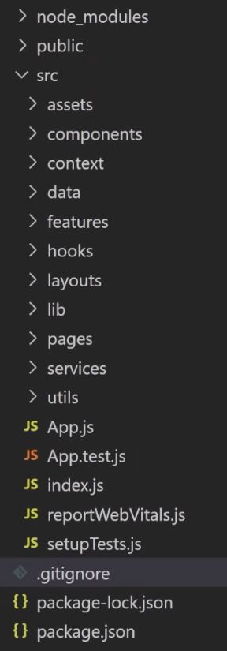
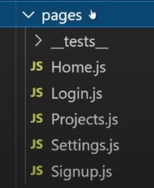
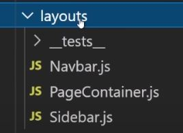
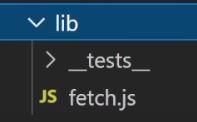
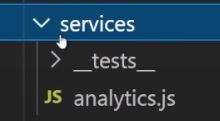
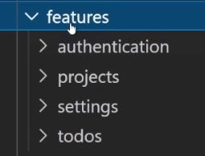
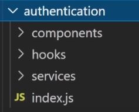
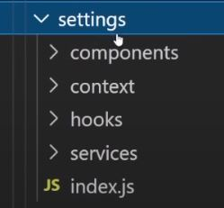
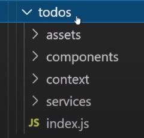

# React Folder Structure - How To Organize React Projects

## Table of contents

- [React Folder Structure - How To Organize React Projects](#react-folder-structure---how-to-organize-react-projects)
  - [Table of contents](#table-of-contents)
  - [1. Intermediate](#1-intermediate)
    - [1.1. assets folder](#11-assets-folder)
    - [1.2. context folder](#12-context-folder)
    - [1.3. data folder](#13-data-folder)
    - [1.4. hooks folder](#14-hooks-folder)
    - [1.5. utils folder](#15-utils-folder)
    - [1.6. components folder](#16-components-folder)
    - [1.7. pages folder](#17-pages-folder)
  - [2. Advanced](#2-advanced)
    - [2.1. pages folder](#21-pages-folder)
    - [2.2. layouts folder](#22-layouts-folder)
    - [2.3. lib folder](#23-lib-folder)
    - [2.4. services folder](#24-services-folder)
    - [2.5. features folder](#25-features-folder)

## 1. Intermediate

### 1.1. assets folder

Contain any type of assets that you import to use in your code, things like _images_, _svg files_, _global CSS_ ...

### 1.2. context folder

Contain all the contexts you create.

### 1.3. data folder

Contain any json data you have or constant values file ...

### 1.4. hooks folder

Contain all the hooks you create.

### 1.5. utils folder

Contain small and simple functions (no matter what input you gave it, it always gave you the same output and it doesn't have any weird side effect) that you use in your project.

### 1.6. components folder

Contain all the components you use in your pages.

The `form` subfolder contain your form components.

The `ui` subfolder contain your form components.

### 1.7. pages folder

Contain many folders, every one is for a specific page of the application.

Every page folder contain components that are unique for the specific page (not shared between many pages).

## 2. Advanced

It's the Intermediate version + some changes & additional folders

### 2.1. pages folder

We no longer have folders, we just have individual files for each of our pages.

### 2.2. layouts folder

Specific for components that deals with links like `Navebar`, `Sidebar` and `Footer`.

### 2.3. lib folder

It's an implementation of the Facade Pattern. For example you use the `axios` library, so you wrap it in your own code.

### 2.4. services folder

Contain all the services for calling your api.

### 2.5. features folder

Contain many folders, every one is for a specific feature of the application.

Every feature folder contain all the code for the specific feature, it's a mini version of the `src` folder the feature.

The `index.js` file is used to export all the things we went to use from the feature, and then we only import it from this `index.js` file.
