# React Folder Structure - How To Organize React Projects

## Table of contents

- [React Folder Structure - How To Organize React Projects](#react-folder-structure---how-to-organize-react-projects)
  - [Table of contents](#table-of-contents)
  - [2. Intermediate](#2-intermediate)
    - [2.1. assets folder](#21-assets-folder)
    - [2.2. context folder](#22-context-folder)
    - [2.3. data folder](#23-data-folder)
    - [2.4. hooks folder](#24-hooks-folder)
    - [2.5. utils folder](#25-utils-folder)
    - [2.6. components folder](#26-components-folder)
    - [2.7. pages folder](#27-pages-folder)

## 2. Intermediate

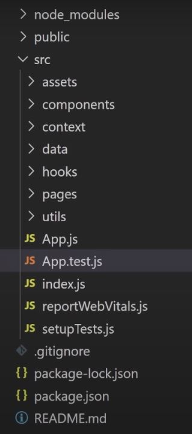

### 2.1. assets folder

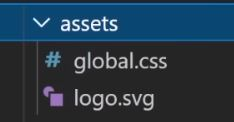

Contain any type of assets that you import to use in your code, things like _images_, _svg files_, _global CSS_ ...

### 2.2. context folder

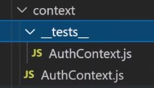

Contain all the contexts you create.

### 2.3. data folder

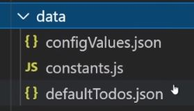

Contain any json data you have or constant values file ...

### 2.4. hooks folder

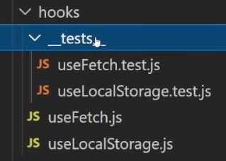

Contain all the hooks you create.

### 2.5. utils folder

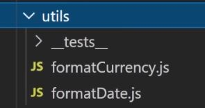

Contain small and simple functions (no matter what input you gave it, it always gave you the same output and it doesn't have any weird side effect) that you use in your project.

### 2.6. components folder

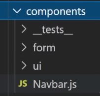

Contain all the components you use in your pages.

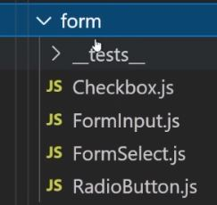

The `form` subfolder contain your form components.

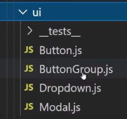

The `ui` subfolder contain your form components.

### 2.7. pages folder

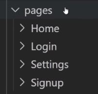

Contain many folders, every one is for a specific page of the application.

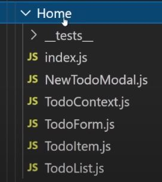

Every folder contain components that are specific for a page (not shared between many pages).
